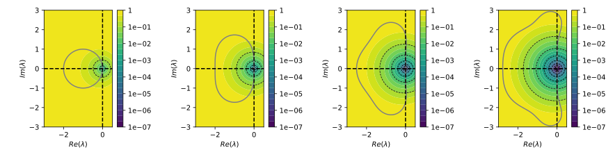

# 4th order Runge Kutta method (the classical one)

## Generic formulation

RK4 is usually written using $k$ coefficients :

$$
u_{t} = u_{0} + \frac{\Delta{t}}{6}(k_1 + 2k_2 + 2k_3 + k_4)
$$

with

$$
\begin{align}
k_1 &= f(u_0,t_0) \\
k_2 &= f\left(u_0 + \frac{\Delta{t}}{2}k_1,
    t_0+\frac{\Delta{t}}{2}\right) \\
k_3 &= f\left(u_0 + \frac{\Delta{t}}{2}k_2,
    t_0+\frac{\Delta{t}}{2}\right) \\
k_4 &= f\left(u_0 + \Delta{t}k_3,
    t_0+\Delta{t}\right) \\
\end{align}
$$

but an other representation is also use, by defining intermediate
solutions :

$$
\begin{align}
u_1 &= u_0 \\
u_2 &= u_0 + \frac{\Delta{t}}{2}f(u_1, t_1) \\
u_3 &= u_0 + \frac{\Delta{t}}{2}f(u_2, t_2) \\
u_4 &= u_0 + \Delta{t}f(u_3, t_3)
\end{align}
$$

and a final update

$$
u_{t} = u_0 + \frac{\Delta{t}}{6}[
    f(u_1, t_1) + 2f(u_2, t_2) + 2f(u_3, t_3) + f(u_4, t_4)]
$$

with $t_1 = t_0$, $t_2 = t_3 = t_0 + \Delta{t}/2$,
and $t_4 = t_0 + \Delta{t}$.

This is actually closer to the Butcher table representation of RK4 :

$$
\begin{array}{c|cccc}
0 & \\
1/2 & 1/2 \\
1/2 & 0 & 1/2 \\
1 & 0 & 0 & 1 \\ 
\hline
& 1/6 & 1/3 & 1/3 & 1/6
\end{array}
$$

where each line in the upper par correspond to a "node" solution $u_m$, and the lower part corresponds to a "prolongation"

## Q-matrix form

From the Butcher table of RK4, we define the collocation matrix

$$
Q = \begin{pmatrix}
    0 & 0 & 0 & 0 \\
    1/2 & 0 & 0 & 0 \\
    0 & 1/2 & 0 & 0 \\
    0 & 0 & 1 & 0
\end{pmatrix},
$$

and the associated nodes
${\bf \tau}=[0, 1/2, 1/2, 1]^T$ and weights
${\bf w}=[1/6, 1/3, 1/3, 1/6]^T$.

Then we build the collocation problem

$$
(I-\Delta{t}Q\otimes f){\bf u} = {\bf u}_0,
$$

which is written in condensed form :

$$
\begin{bmatrix}
    1 & 0 & 0 & 0 \\
    -\frac{\Delta{t} f}{2} & 1 & 0 & 0 \\
    0 & - \frac{\Delta{t} f}{2} & 1 & 0 \\
    0 & 0 & - \Delta{t} f & 1 \\
\end{bmatrix}\begin{pmatrix}
    u_1 \\ 
    u_2 \\ 
    u_3 \\ 
    u_4 \\
\end{pmatrix} = \begin{pmatrix}
    u_0 \\ 
    u_0 \\ 
    u_0 \\ 
    u_0 \\
\end{pmatrix}
$$

where any $f$ term in the matrix correspond to the evaluation of a "node" solution $u_m$ at its corresponding time $t_0 + \Delta{t}\tau_m$.
Finally, the prolongation (or final update) is computed to retrieve the final solution

$$
u_{n+1} = u_n + \frac{\Delta{t}}{6}[
f(u_1, t_1) + 2f(u_2, t_2) + 2f(u_3, t_3) + f(u_4, t_4)
]
$$

Note that final update can be included into the $Q$-matrix formulation by addind $u_t$ to the node vector and writing

$$
Q = \left[\begin{matrix}
0 & 0 & 0 & 0 & 0 \\
1/2 & 0 & 0 & 0 & 0\\
0 & 1/2 & 0 & 0 & 0 \\
0 & 0 & 1 & 0 & 0 \\
1/6 & 1/3, & 1/3 & 1/6 & 0
\end{matrix}\right],
$$

which is the matrix form implemented in the `RungeKutta` class of `pySDC` by Thomas.
It shows that the Butcher table of RK4 are simply representing the Zeros-to-Nodes (Z2N) $Q$-matrix formulation of the RK4 method 
(see [this note](./node-formulation.md)).

## Picard iteration of RK4

We solve the collocation problem built using the full $Q$-matrix of RK4 (containing the final update) by the mean of Picard iteration, that is :

$$
{\bf u}^{k+1} = {\bf u}_0 + \Delta{t} Q \otimes f {\bf u}^{k}, \text{ with } {\bf u}^0 = {\bf u}_0.
$$

This corresponds to computing the preconditionned iteration for the collocation problem

$$
{\bf u}^{k+1} = {\bf u}^{k} + M^{-1}\left[{\bf u}_0 - (I-\Delta{t}Q\otimes f){\bf u}^k\right]
$$

using the identity for preconditionner $M$. 

For each iteration $k \in \{1, 2, 3, 4\}$ we plot the accuracy and stability contour in the complex plane, and show them in the following figure 
(increasing $k$ from left to right) :

Some first observations :

- Each Picard iteration seems to increase the order of accuracy by one, as we successively get the stability contour of Forward Euler (with  $k=1$), a second order RK method in two stages (with $k=2$), a third order RK method in three stage (with $k=3$) and finally the stability contour of RK4 (with $k=4$).
- The first Picard iterations are not A-stable, and need several iterations (with $k\geq 3$) to include a part a the imaginary axis (necessary condition to be stable for a fully hyperbolic problem). _Hypothesis_ : this is due to the strictly lower triangular form of the RK4 $Q$-matrix ?

:raised_eyebrow: the stability and Picard iteration seems to be the same as the one of collocation methods, for instance considering 4 Lobatto-Legendre points (image generated using the [02_Collocation.py](../../python/scripts/02_Collocation.py) script) :

